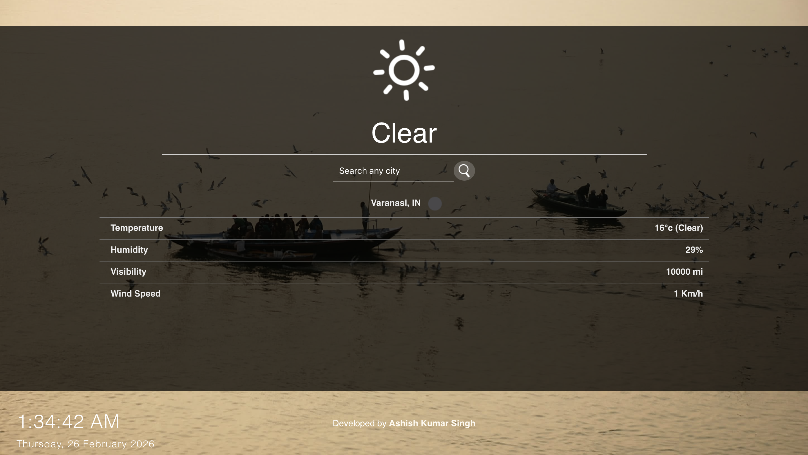

# Weather App 🌤️


Live Demo: [https://react-site-weather.netlify.app/]

---

## 📸 Screenshots

Below are a few screenshots from the live deployed app:




---

## 🚀 Features

- 🌍 **Detects current location** and shows the weather automatically.
- 🔍 **Search any city** to get its current weather.
- 🌡️ Displays temperature, humidity, wind speed, visibility & more.
- 🗓️ Real-time clock and date display.
- 🖼️ Dynamic beautiful backgrounds from Unsplash based on the searched city.
- 📱 Fully responsive UI on desktop and mobile.
- ⭐ Animated weather icons using `react-animated-weather`.

---

## 🛠️ Built With

| Technology | Purpose |
|------------|---------|
| React.js | Frontend UI framework |
| Axios | API requests |
| OpenWeatherMap API | Weather data |
| Unsplash API | City images |
| Netlify | Deployment |
| CSS3 | Styling |

---

## 📁 Folder Structure

weather-app/
├── public/
├── src/
│ ├── apiKeys.js
│ ├── Clock.js
│ ├── currentLocation.js
│ ├── forcast.js
│ ├── images/
│ ├── index.js
│ └── App.css
├── screenshots
│ ├── home.png
│ └── search.png
├── .env
├── .gitignore
├── package.json
└── README.md


---

## ⚙️ Installation

 Clone repo:

```bash
git clone https://github.com/Ashish870code/weather-app.git
cd weather-app

npm install


##  📁 Create a .env file (root):

REACT_APP_WEATHER_KEY=your_openweathermap_api_key
REACT_APP_UNSPLASH_KEY=your_unsplash_api_key

npm start

----

## 📦 Deployment

Live on Netlify:
🔗 https://react-site-weather.netlify.app/

To re‑deploy yourself:

Connect GitHub repo to Netlify.

Add Environment Variables:

    REACT_APP_WEATHER_KEY=your_weather_api_key
    REACT_APP_UNSPLASH_KEY=your_unsplash_api_key
    CI=false


Build command: npm run build

Publish folder: build/

Deploy

---

## 👨‍💻 Author

Ashish Kumar Singh
GitHub: https://github.com/Ashish870code

Live-Site: https://react-site-weather.netlify.app/

